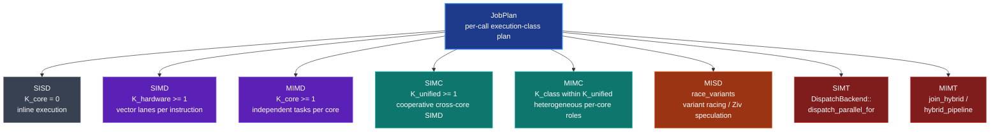
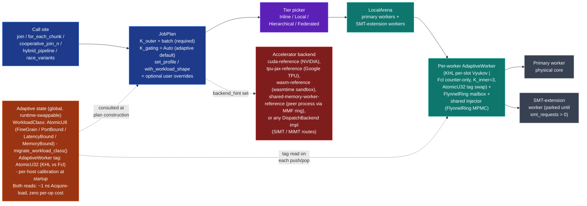
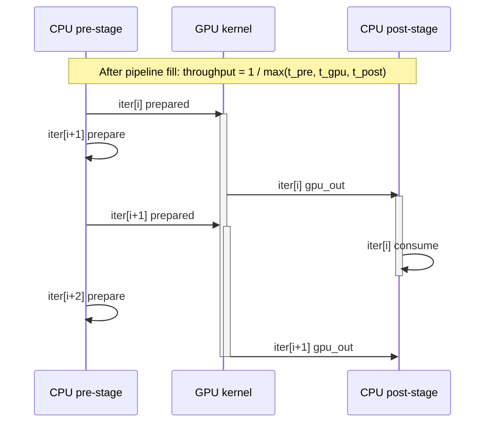

<div align="center">


# Flynnel

**A K-aware, NUMA-aware work-stealing scheduler with extended-Flynn-taxonomy dispatch.**

[](https://crates.io/crates/flynnel)
[](https://docs.rs/flynnel)
[](LICENSE)
[](https://www.rust-lang.org)
[](https://doc.rust-lang.org/edition-guide/rust-2024/)

Parallel schedulers usually treat every job the same: fork it, join it, done. Flynnel asks one extra question per call - *what shape of parallel is this?* - and routes the work to the primitive that fits: independent fork-join, cooperative cross-core vector, hybrid CPU + accelerator pipeline (GPU, TPU, or any registered backend), or speculative variant race. One [`JobPlan`](#dispatch-profiles) carries the hint; the dispatcher handles the rest.

</div>

---

<details>
<summary><b>Table of contents</b></summary>

- [Why Flynnel](#why-flynnel)
- [Quick start](#quick-start)
- [Extended Flynn taxonomy](#extended-flynn-taxonomy)
- [Architecture](#architecture)
- [Dispatch profiles](#dispatch-profiles)
- [Benchmark results](#benchmark-results)
- [Primitives](#primitives)
- [Cargo features](#cargo-features)
- [Portability and MSRV](#portability-and-msrv)
- [Credits and influences](#credits-and-influences)
- [Citations](#citations)
- [License](#license)
- [Contributing](#contributing)

</details>

---

## Why Flynnel

Real workloads rarely fit one shape of parallel. A numerical solver runs independent fork-join across its outer loop, switches to cooperative cross-core reduction at the inner loop, then races a fast-and-faithful pair at the convergence check. A Bayesian inference loop wants the CPU and GPU to overlap stage-by-stage across iterations. A linear-algebra kernel needs one core to factor the pivot while the other seven apply it.

Without a scheduler that knows the difference, each shape gets hand-rolled: `rayon::scope` for one, a homegrown `Mutex<Vec>` reduction for another, a bespoke channel pipeline for the GPU stages. Each handcrafted glue layer is a place where the wrong primitive quietly costs a multiplicative factor in coordination overhead - what fits fork-join (independent leaves, work-stealing balance) is wrong for cooperative cross-core (uniform closures, single sync boundary), and what fits cooperative is wrong for hybrid CPU + accelerator pipelines (stage-coupled, latency-hidden by overlap). The mismatch hurts most at fine-grain coordination, where per-task setup and sync-barrier latency dominate the leaf body.

Flynnel ships first-class primitives for the six common shapes, all behind one `JobPlan`:

| Shape of work                                                                  | Primitive                             | Flynn axis           |
|--------------------------------------------------------------------------------|---------------------------------------|----------------------|
| Independent fork-join                                                          | `join`, `for_each_chunk`              | MIMD                 |
| Cooperative cross-core vector (uniform closures, single sync boundary)         | `cooperative_join_n`                  | SIMC                 |
| Heterogeneous-role cooperative (mixed closures, one role per closure)          | `cooperative_join_n`                  | MIMC                 |
| Speculative variant race (fast path + faithful + correctly-rounded safety)     | `race_variants`                       | MISD                 |
| Explore-all + best-by-comparator (episode racing / population search)          | `explore_select`                      | MIMD (collect+select)|
| Hedged / quorum / duel / consensus / anytime / tournament / statistical races  | `race_any`, `race_quorum`, `race_refute`, `race_agree`, `race_deadline`, `race_tournament`, `race_statistical` | MISD / MIMD |
| Independent CPU + accelerator pair *                                           | `join_hybrid`                         | MIMT (single-pair)   |
| CPU + accelerator iterated pipeline (each iter's accelerator stage feeds CPU) *| `hybrid_pipeline`                     | MIMT (streamed)      |

<sub>* **Accelerator** = any backend registered through the `DispatchBackend` trait. Flynnel ships four reference impls: NVIDIA CUDA (`cuda-reference`), Google TPU via JAX (`tpu-jax-reference`), WebAssembly via wasmtime (`wasm-reference`), and a cross-process shared-memory worker over a lock-free MMF ring (`shared-memory-worker-reference`). The MIMT primitives route through `JobPlan::pick_backend()` and work with whatever the consumer registered (ROCm, Metal, FPGA, custom ASIC, sandboxed peer process), no per-target call-site changes.</sub>

Underneath every call, a [`DispatchProfile`](#dispatch-profiles) hint picks SMT-sibling activation correctly per workload: on for Newton-iteration chains where SMT fills stall bubbles; off for IMUL-saturated multiplies where SMT contests the same execution port; on for sparse matvec where the second sibling issues loads while the first stalls on a cache miss. The decision is per call, not per process - no global toggle, no preset to forget.

### About the name

A layered pun on **Flynn + flannel**. [Michael J. Flynn](https://en.wikipedia.org/wiki/Michael_J._Flynn) classified parallel architectures in 1966 along two orthogonal axes (instruction streams x data streams), producing the original SISD / SIMD / MISD / MIMD quartet this crate's execution-class plan extends to eight. Flannel - the woven fabric - is what you get when you cross two orthogonal sets of threads (warp x weft). Same geometry, different domain. The work-stealing lineage Flynnel inherits from runs MIT Cilk -> Rust rayon -> Flynnel.

## Quick start

```toml
[dependencies]
flynnel = "0.2"
```

### Plan-driven surface (adaptive by default; override when you know better)

`JobPlan` is adaptive out of the box: the default `JobPlan::new(K, batch)` runs a static classifier on `(K, batch)` that picks a `WorkloadClass` (FineGrain / PortBound / LatencyBound / MemoryBound / Streaming) so call 1 routes correctly, sets `k_gating: KGating::Auto` (the scheduler picks between the KHL per-slot Vyukov and Fcl counter-only K_inner=3 backings from host calibration), and resolves the cooperative-routing and bisect-variant global tags via single AtomicU8 Acquire-loads (~1 ns, zero per-op cost). Later calls at the same call site refine from that site's learned class; `migrate_workload_class()` flips the process-global class the `AdaptiveDispatcher` surface consults. Calling `JobPlan::new` is enough for ~every typical use case.

```rust
use flynnel::{JobPlan, join};

// Adaptive default: scheduler picks KHL vs Fcl, mailbox routing,
// SMT activation, and oversubscription from host calibration +
// the static classifier's WorkloadClass for (K, batch).
let plan = JobPlan::new(8, 1024);

let (sum_a, sum_b) = join(
    &plan,
    || (0..1024).sum::<u32>(),
    || (1024..2048).sum::<u32>(),
);
```

The constructor arguments:

- `k_outer = 8` - log2 of the logical sub-unit count per operand (used by the tier picker)
- `batch = 1024` - total item count

<details>
<summary><h3>User override (`set_profile`)</h3></summary>

When you know your workload's profile better than the scheduler's calibration would (for example, you're certain this call is port-bound and want SMT siblings parked unconditionally), use `JobPlan::set_profile` to pin the choice for this one call:

```rust
use flynnel::{JobPlan, DispatchProfile, join};

let plan = JobPlan::set_profile(8, 1024, DispatchProfile::PortBound);

let (sum_a, sum_b) = join(
    &plan,
    || (0..1024).sum::<u32>(),
    || (1024..2048).sum::<u32>(),
);
```

`set_profile` overrides the adaptive defaults for **this call only**: it pins `use_smt`, `estimated_per_item_ns`, `oversubscription_log2`, `use_mailbox_routing`, and `deque_tier_hint` to the profile's defaults. The K_gating axis stays `Auto` so the K_inner=3 backing choice remains adaptive. The five available profiles (see [Dispatch profiles](#dispatch-profiles) below for the full defaults table):

- `DispatchProfile::LatencyBound` - long FP dependency chains, SMT siblings hide stall bubbles (SMT active, 600 ns/elem, 4x oversub)
- `DispatchProfile::PortBound` - IMUL/FMA saturated, SMT siblings would contest the execution unit (SMT parked, 12 ns/elem, 2x oversub)
- `DispatchProfile::MemoryBound` - pointer-chasing or sparse gather, SMT siblings interleave cache misses (SMT active, 50 ns/elem, 2x oversub)
- `DispatchProfile::Streaming` - per-core bandwidth-bound sequential scans; SMT siblings would contest the same L2/L3 bandwidth (SMT parked, 50 ns/elem, 2x oversub)
- `DispatchProfile::Unspecified` - call site has no classification data; per-call cost-derived tuning is disabled (SMT parked, no cost estimate, 2x oversub)

#### Workload-shape declarative override (`with_workload_shape`)

For an even more explicit-but-still-declarative override, `JobPlan::new(...).with_workload_shape(WorkloadShape::Streaming)` swings the K_gating / mailbox / oversubscription knobs together based on the shape. Use this when the call site has a clean architectural label (streaming pipeline, producer-fast burst, work-steal fan-out, cooperative reduction, variant race). See `flynnel::sched::workload_shape::WorkloadShape`.

Workhorse primitives (`join`, `for_each_chunk`, `JobPlan`, `cooperative_join_n`, `join_hybrid`, `hybrid_pipeline`, `race_variants`, `k_join`) live at the crate root following the rayon / tokio convention. Specialized variants stay namespaced under `flynnel::sched::*`.
</details>

### Plan-free surface (no `JobPlan` required)

For consumers who prefer a plain-function-call API shape over constructing a `JobPlan` value explicitly, the [`flynnel::flat`](src/flat.rs) module gives plan-free entry points that delegate to the same adaptive scheduler. Both surfaces consult the global `WorkloadClass` / `DispatchProfile` routing transparently, so the choice is purely API ergonomics:

```rust
let (left, right) = flynnel::flat::join(
    || (0..1000).sum::<u32>(),
    || (1000..2000).sum::<u32>(),
);

let mut data: Vec<u32> = (0..1_000_000).collect();
flynnel::flat::par_for_each_mut(&mut data, |x| *x = x.wrapping_mul(3));

let mut blocks: Vec<f64> = (1..=1_000_000).map(|i| i as f64).collect();
flynnel::flat::par_for_each_chunk_mut(&mut blocks, |slice| {
    for x in slice { *x = x.sqrt(); }
});
```

The three plan-free entry points:

| Function | Shape | Behavior |
|---|---|---|
| `flynnel::flat::join(a, b)` | Two-way fork-join | Runs both closures concurrently on the work-stealing arena; returns their results in caller order. Delegates to `sched::arena::join` with an auto-constructed `JobPlan`. |
| `flynnel::flat::par_for_each_mut(&mut v, op)` | Per-element data-parallel | Bisects the slice into per-item leaves; `op` runs once per element concurrently across workers. |
| `flynnel::flat::par_for_each_chunk_mut(&mut v, op)` | Per-chunk data-parallel | Bisects the slice into chunks whose size is picked by the tier-picker + adaptive-splitter; `op` runs once per chunk with a `&mut [T]` argument. Use this when the per-element work is small enough that SIMD or hoisted setup inside the chunk matters. |

All three are free functions with no prelude import required.


## Extended Flynn taxonomy



<details>
<summary><b>Full axis-by-axis description</b></summary>

| Acronym | Expansion                                  | Flynnel surface                                                  |
|---------|--------------------------------------------|------------------------------------------------------------------|
| SISD    | Single Instruction, Single Data            | `K_core = 0` - inline execution, no fork                         |
| SIMD    | Single Instruction, Multiple Data          | `K_hardware >= 1` - vector lanes per instruction                 |
| MISD    | Multiple Instruction, Single Data          | `race_variants` - variant racing / Ziv speculation               |
| MIMD    | Multiple Instruction, Multiple Data        | `K_core >= 1` - independent tasks per core (`join`, `for_each_chunk`, `explore_select`) |
| SIMC    | Single Instruction, Multiple Cores         | `K_unified >= 1` - cooperative cross-core SIMD (`cooperative_join_n` with uniform closures) |
| MIMC    | Multiple Instruction, Multiple Cores       | `K_class within K_unified` - heterogeneous per-core roles in one mega-vector (`cooperative_join_n` with mixed closures) |
| SIMT    | Single Instruction, Multiple Threads       | `DispatchBackend::dispatch_parallel_for` - any registered accelerator (CUDA, TPU, ROCm, Metal, ANE, WASM, SharedMemoryWorker, Custom). Reference impls: `cuda-reference` (NVIDIA, warp-cooperative kernels under `kernels/`), `tpu-jax-reference` (Google TPU via JAX bridge), `wasm-reference` (wasmtime sandbox, scalar single-threaded), `shared-memory-worker-reference` (cross-process peer worker over an MMF ring) |
| MIMT    | Multiple Instruction, Multiple Threads     | `join_hybrid` for one CPU + accelerator pair; `hybrid_pipeline` for iterated coupled CPU + accelerator algorithms |

The MISD / MIMC / MIMT rows are the distinctive ones - no general-purpose Rust scheduler ships a cross-algorithm verification primitive, cooperative cross-core SIMD, or first-class CPU + accelerator pipelined dispatch at this granularity.

</details>

## Architecture



<details>
<summary><b>Four load-bearing invariants</b></summary>

**1. Single pool with primary + SMT-extension workers.** A `LocalArena` spawns `primary_count` workers (one per physical core) plus `primary * (smt - 1)` extension workers (one per SMT sibling). Extension workers park at the top of their loop while `smt_requests == 0`. This gives both regimes - primary-only for IMUL / FMA-saturated work, primary + SMT for latency-bound work - out of ONE worker pool. No oversubscription, ever.

**2. SMT guard lifecycle.** `arena.acquire_smt()` is called once at dispatch entry when the plan's effective `use_smt` is true. The guard increments `smt_requests` atomically; on drop (after the latch wait), it decrements. Siblings spin up while at least one guard is alive and re-park when the counter hits zero. Guards are stored in the outer scope so they outlive the latch wait.

**3. Variance-driven SMT suppression.** A per-leaf cv-squared observer feeds back into `JobPlan::effective_use_smt()`. Uniform-cost work (low variance) keeps siblings parked even when the dispatch profile would otherwise enable them, because SMT helps when sibling threads can fill stall bubbles in heterogeneous workloads - not when every leaf is the same shape.

**4. Adaptive dispatch at zero per-op cost.** The plan-driven surface is adaptive by default along five orthogonal atomic-tag axes, each implemented as an atomic read so the per-op hot path stays bare. (a) **K_gating** picks between the KHL (per-slot Vyukov) and Fcl (counter-only Chase-Lev) K_inner=3 backings; the choice is per-worker, swapped via a single `AtomicU32::Release-store` from the calibration cell at startup or from `migrate_all_workers_k_gating()` at runtime. Each push / pop reads the tag with one `Relaxed` load (~1 ns) before branching to the active backing. (b) **WorkloadClass** (FineGrain / PortBound / LatencyBound / MemoryBound / Streaming): `JobPlan::new` picks it statically from `(K, batch)` for call-1 routing, per-call-site learned classes refine unpinned plans at the dispatch entries, and the process-global tag drives the `AdaptiveDispatcher` surface. The closing-loop observer `tick_auto_classify()` ingests the per-leaf time variance counters and migrates the active class automatically when observed shape diverges from active by bucket distance >= 2 (instant migrate) or holds steady for 2 consecutive ticks at adjacent distance (hysteresis migrate); `migrate_workload_class()` is the explicit override, one atomic store. (c) **CooperativeRouting** picks tree-bisect / flat-deque / flat-mailbox for `cooperative_join_n` via `active_cooperative_routing()`. (d) **VariantRouting** picks the active bisect-variant override for `for_each_chunk` via `active_variant_routing()`. (e) **Backend** picks CPU vs accelerator via `active_backend_id()`. `JobPlan::set_profile(...)` and `with_workload_shape(...)` are explicit per-call overrides that pin the WorkloadClass choice for one dispatch only; both leave `K_gating: Auto` so the backing selection stays runtime-swappable.

</details>

<details>
<summary><b>Hybrid CPU + accelerator pipeline (MIMT) - GPU shown as example</b></summary>



`hybrid_pipeline` runs each iteration as three stages: CPU prepares input, accelerator computes, CPU consumes output. The accelerator stage in the diagram is shown as a GPU but the same pipeline shape applies when the registered backend is a TPU (via `tpu-jax-reference`) or any custom `DispatchBackend` impl - the primitive does not bake in the device type. After fill, the smaller stages hide behind the largest, so the bound is the longest single stage. Measured 1.84x-2.35x speedups on RTX 3070 for MCMC / batched-CG / MCTS workloads at `CYCLES_PER_SAMPLE = 64` against the asymptotic 2.91x ceiling for that cycle count (see [bench numbers](#benchmark-results)).

</details>

## Dispatch profiles

`JobPlan::set_profile(K, batch, DispatchProfile::*)` sets SMT routing, per-element cost estimate, and oversubscription together from one of five scheduler-native profiles:

| Profile        | SMT siblings | Cost / elem (ns) | Oversub (log2 / multiplier) | Typical work                                       |
|----------------|--------------|------------------|------------------------------|----------------------------------------------------|
| `LatencyBound` | on           | 600              | 2 (4x)                       | Newton iterations, division chains, square roots   |
| `PortBound`    | off          | 12               | 1 (2x)                       | IMUL / FMA-saturated multiplies, additions         |
| `MemoryBound`  | on           | 50               | 1 (2x)                       | Pointer-chase / sparse gather / hash probes        |
| `Streaming`    | off          | 50               | 1 (2x)                       | Per-core bandwidth-bound: byte scan, image kernels, histogram, prefix-sum block sums |
| `Unspecified`  | off          | None             | 1 (2x)                       | Default when call-site classification is unknown   |

Source: [`src/dispatch_profile.rs`](src/dispatch_profile.rs) and verified by the `for_profile_sets_smt_cost_and_oversubscription_together` test in [`src/sched/plan.rs`](src/sched/plan.rs).

Power-user overrides compose with the profile:

```rust
use flynnel::{JobPlan, DispatchProfile};

let plan = JobPlan::set_profile(8, 1024, DispatchProfile::MemoryBound)
    .with_cost_ns_per_elem(80)
    .with_oversubscription_log2(3)
    .with_workers(16);
```

## Benchmark results

Flynnel maintains an internal bench harness under [`benches/`](benches/) organized by category. All benches use [criterion 0.8.2](https://crates.io/crates/criterion) unless the `[[bench]]` entry sets `harness = false` (in which case they are standalone binaries with `fn main()`). Reproduction instructions and the recorded cross-host numbers live in [`wiki/content/docs/reference/Benchmarks.md`](wiki/content/docs/reference/Benchmarks.md).

### Bench categories

| Category | Bench files | What it measures |
|---|---|---|
| Dispatch overhead isolation | `sched_overhead_isolation`, `join_overhead`, `dispatcher_routing` | Per-call scheduler cost (nanoseconds) on empty / near-empty closures. Isolates the plumbing cost from the workload cost. |
| Data-parallel workloads | `inline_collapse`, `parameter_sweep`, `cold_workloads` | End-to-end wall-clock on realistic parallel workloads across per-item-cost and batch-size axes. |
| Cross-process backend | `chase_lev_mmf` | Per-op cost of the memory-mapped Chase-Lev deque that backs the `shared-memory-worker-reference` cross-process dispatch. |
| Wait-strategy A/B | `parker_wait_strategy` | Parker wake-latency across yield / park / WAITPKG modes; the input to `WaitStrategy::pick`. |
| Cross-mode dispatch | `flynn_axes`, `mimt_coupled`, `simc_cooperative`, `simc_n12_bisect` | The SIMD / SIMC / MIMD / MIMT / MISD extended-Flynn-taxonomy path costs, including CPU+GPU hybrid dispatch (`join_hybrid`, `hybrid_pipeline`, `cooperative_join_n`, `race_variants`). |

### Workload class taxonomy

The bench matrix exercises five distinct scheduler-decision classes; each isolates a specific dispatch policy:

| Class | Op shape (per element) | Per-elem cost | Scheduler decision exercised | Winning profile |
|---|---|---|---|---|
| **Fine-Grain** | 3-deep sqrt chain | ~20 ns | Inline-collapse: aggregate work below the parallel-dispatch crossover should run inline-serial without paying the fork cost. | (none - inline path fires; no parallel dispatch) |
| **Latency-Bound** | 100-deep sqrt chain | ~600 ns | SMT activation on the FP-dependency-chain stall pattern (each `sqrtsd` stalls; siblings hide the bubbles). | [`DispatchProfile::LatencyBound`](#dispatch-profiles) (SMT-on, 4x oversubscribe) |
| **Port-Bound** | 50-deep u128 IMUL chain | ~12-15 ns | SMT deactivation on the pipe-saturating pattern (single IMUL port; siblings contest, reducing throughput). | [`DispatchProfile::PortBound`](#dispatch-profiles) (SMT-off, 2x oversubscribe) |
| **Memory-Bound** | Cache-miss gather (SpMV, PageRank) | 500-2000 ns | Prefetch + oversubscription to interleave stall pairs. | [`DispatchProfile::MemoryBound`](#dispatch-profiles) (SMT-on, cache-miss interleave) |
| **Streaming** | Byte-scan / image kernel / histogram | ~10-50 ns | Coarser leaf size (bandwidth-bound; per-leaf-overhead-amortized). SMT parked because sibling threads on the same core contest the same L2/L3 bandwidth. | [`DispatchProfile::Streaming`](#dispatch-profiles) (SMT-off, 2x oversubscribe) |

### Cold-workload measurements

The `cold_workloads` bench (`benches/cold_workloads.rs`, `harness = false`) is the most-representative harness for one-off dispatch latency. It runs each workload shape 10 times with a **mandatory 100 ms sleep between samples** to force the JEC sleep coordinator to park workers between calls. That matches the real-world reality of a CLI tool, notebook cell, or API handler dispatching one batch and then going idle - as opposed to criterion's iter-back-to-back pattern that keeps workers hot and hides the wake-on-push latency.

Shapes covered by `cold_workloads`:

| Shape | Items | Per-item cost | Total work | What it isolates |
|---|---|---|---|---|
| `nmfd_5x100ms` | 5 | 100 ms | 500 ms | Small-N heavy-per-item (NMFD / ML inference batches) |
| `shallow_4x10ms`, `shallow_8x10ms`, `shallow_16x10ms` | 4/8/16 | 10 ms | 40-160 ms | Shallow bisect depth, heavy items |
| `medium_32x1ms` | 32 | 1 ms | 32 ms | Balanced medium workload |
| `medium_128x500us` | 128 | 500 us | 64 ms | Higher-N moderate items |
| `deep_1024x100us` | 1024 | 100 us | ~102 ms | Deep-recursion bisect |
| `stream_16k_10us` | 16 384 | 10 us | ~164 ms | Streaming many-light-items |

Each cell reports median + p10 + p90 durations to stderr. Cross-host sweeps run on a local Windows 4C/8T box, a Linux VM on Zen3 (16 threads), and a Linux VPS on EPYC (32 threads); the recorded numbers live in [`wiki/content/docs/reference/Benchmarks.md`](wiki/content/docs/reference/Benchmarks.md).

### Speedup measurements (accelerator paths vs sequential CPU)

The extended-Flynn-taxonomy accelerator paths measure `hybrid_pipeline` and CUDA/TPU dispatch as speedups vs the sequential CPU baseline. Numbers reproduce with `cargo bench --bench flynn_axes --features cuda-reference` and `cargo bench --bench mimt_coupled --features cuda-reference`.

<details open>
<summary><b>Flynn-axes accelerator paths</b> (Zen+ Ryzen 7 2700 / 16T + RTX 3070; Xeon Cascade Lake / 12T + L4)</summary>

| Axis  | Workload | Zen+ / RTX 3070 vs sequential CPU | Xeon Cascade Lake / L4 vs sequential CPU |
|---|---|---|---|
| SIMT | per-call H2D + kernel + D2H | **6.66x faster** | **6.97x faster** (3.67ms vs 25.62ms CPU) |
| SIMT | persistent device buffer | **255x faster** | **602x faster** (42.5us vs 25.62ms CPU) |
| SIMT | warp-cooperative (`shfl.sync.bfly`) | **313x faster** | **1830x faster** (14.0us vs 25.62ms CPU); **3.04x** faster than persistent buffer |
| MIMT | pipelined Metropolis MCMC | **1.96x faster** than sequential | **1.52x faster** than sequential (hybrid 321.8ms vs sequential 487.9ms) |
| MIMT | pipelined batched CG | **2.35x faster** than sequential | **2.48x faster** than sequential (hybrid 214.4ms vs sequential 532.4ms) |
| MIMT | pipelined AlphaZero-shape MCTS | **1.84x faster** than sequential | **1.74x faster** than sequential (hybrid 204.0ms vs sequential 355.7ms) |

The SIMT and MIMT-pipelined numbers measure the architectural value of Flynnel's first-class CPU + accelerator surface: a single `hybrid_pipeline` call replaces what would otherwise be hand-rolled stream / event / launch-queue plumbing. The Zen+ measurements use NVIDIA RTX 3070; the Xeon measurements use NVIDIA L4 (Ada Lovelace generation, ~30 TFLOPS fp32). On a TPU host the `gpu` closure swaps to a `TpuJaxBackend::dispatch_kernel` call and the rest of the pipeline shape is unchanged.

`cooperative_join_n` is **adaptive on N**: a balanced binary tree of `sched::join` (depth `log2(N)`) for `N < 12`, a flat fan-out of N StackJobs onto the local deque (depth 1) for `N >= 12`. The tree amortizes per-StackJob setup across the bisect (wins at short closures, e.g. MIMC pivoted-LU N=8 at ~17 us); the flat fan-out trims the critical-path nesting the tree's `log2(N)` levels add to the slowest closure (wins at multi-millisecond closures at SMT-pool saturation). The N=12 split came from the internal flat-vs-tree A/B on the SIMC shape; callers whose workload breaks the assumption (sub-10us at N>=12, or 100us+ at N<12) can call [`cooperative_join_n_tree`](src/sched/cooperative.rs) or [`cooperative_join_n_flat`](src/sched/cooperative.rs) directly.

</details>

Full bench reproduction instructions and per-cell audit notes live in [`wiki/content/docs/reference/Benchmarks.md`](wiki/content/docs/reference/Benchmarks.md).

<details open>
<summary><b>Cross-process dispatch (Zen+ Ryzen 7 2700, <code>chase_lev_mmf</code> bench)</b></summary>

| Dispatch mechanism                               | Per-call latency (median) | Ratio vs in-process |
|--------------------------------------------------|---------------------------|---------------------|
| `flynnel::flat::join` (in-process scheduler)     | **16.9 ns**               | 1x                  |
| Chase-Lev MMF backend, SMT-siblings pinned       | **342 ns**                | 20x slower          |
| Chase-Lev MMF backend, intra-CCX pinned          | **424 ns**                | 25x slower          |
| Chase-Lev MMF backend, unpinned                  | **533 ns**                | 32x slower          |
| Chase-Lev MMF backend, cross-CCX pinned          | **881 ns**                | 52x slower          |
| `std::sync::mpsc::sync_channel` round-trip       | **909.5 ns**              | 54x slower          |

The Chase-Lev MMF backend beats `std::sync::mpsc` in every pinning tier. The architectural point: a Chase-Lev deque's asymmetric ownership (owner's hot path is one Release-store on `bottom`; only thieves CAS the other end on `top`) beats both the MPMC two-contended-atomic-header pattern and `std::sync::mpsc`'s `Mutex<Condvar>` parking, even after paying for full kernel-handle and arg-blob encode/decode on every call.

Per-call cost sits at 20-52x the in-process scheduler depending on which coherence tier the dispatcher + drainer pair lands on. The trade is **100-500x faster than pipe-based IPC** (~20-50 us on this host) for the case in-process cannot serve: sandboxed worker farms, cross-language interop with anything that can mmap a file, and process-isolated runtimes that need a dispatch surface cheaper than `Command` + JSON-over-pipe.

</details>


## Primitives

<details>
<summary><b>Crate-root surface</b> (rayon / tokio convention)</summary>

| Primitive             | Flynn axis | Use when                                                                 |
|-----------------------|------------|--------------------------------------------------------------------------|
| `join(a, b)`          | MIMD       | Two-way fork-join; the bread-and-butter primitive                        |
| `for_each_chunk`      | MIMD       | Data-parallel slice sweep with adaptive bisection                        |
| `for_each_indexed`    | MIMD       | `f(i)` for every index once, no slice to mutate; same probe, site statistics and bisect |
| `for_each_chunk_ref`  | MIMD       | Read-only chunk walk at a fixed width over a shared slice                |
| `CancelToken`         | MISD       | Caller-built cancellation shared by the arms of a race composed on `join` or the walkers |
| `JobPlan`             | -          | Per-call execution-class plan; carries K, batch, profile, overrides      |
| `cooperative_join_n`  | SIMC/MIMC  | N closures running as ONE logical mega-vector with sync at boundary      |
| `join_hybrid`         | MIMT       | ONE independent CPU + accelerator pair (GPU, TPU, or custom backend)     |
| `hybrid_pipeline`     | MIMT       | Iterated coupled algorithm where each iter's accelerator stage feeds CPU |
| `race_variants`       | MISD       | Variant racing / Ziv speculation (first tolerable wins)                  |
| `explore_select`      | MIMD       | Explore-all + best-by-comparator (episode racing / population search)    |
| `race_any`            | MISD       | Hedged racing: first of n interchangeable attempts wins (tail latency)   |
| `race_quorum`         | MISD       | First k of n replicas to answer; stragglers cancel                       |
| `race_refute`         | MISD       | Prover vs refuter duel; first to settle wins (SAT portfolio, probes)     |
| `race_agree`          | MISD       | Consensus by vote; disagreement is a detected fault (N-version)          |
| `race_deadline`       | MIMD       | Anytime racing: best published result at a wall-clock deadline           |
| `race_tournament`     | MIMD       | Successive halving: prune by interim score, boost survivors' budget      |
| `race_statistical`    | MIMD       | Hoeffding races: cut noisy candidates by confidence bound                |
| `L3Reservation`       | -          | CPU L3 cache-way reservation via resctrl / CAT (Zen2+/RDT Linux)          |
| `k_join`              | -          | K-way fork over a const-generic K                                        |
| `hybrid_auto_split_ranges` | MIMT  | Learned CPU/backend split of n items by index range, share per call site and batch-size bucket; the backend side may work on resident data |
| `gpu_peer::linalg`    | SIMT       | House-owned f64 batched einsum, GEMM, symmetric-eig and SVD (Jacobi, and Householder + bisection), LU factor / solve / inverse kernels over resident VRAM blocks (driver-JIT PTX, no vendor library), each with a CPU reference; `*_tandem_batched` helpers split a batch between the device and the CPU pool |
| `dispatch_accel`      | SIMT/MIMT  | Auto-routes a registered op between its CPU impl and a bound accelerator kernel: launch-amortization cost gate, then per-call-site learned placement (race cold, exploit warm) |

**Auto accelerator routing.** An op registered once in both forms - a CPU implementation via `register_accel_op` and a per-backend kernel via `bind_accel_kernel` - is routed automatically by `dispatch_accel`: sub-breakeven batches stay on the CPU (estimated total work must clear 4x the backend's launch latency plus the H2D transfer), a cold size bucket races both sides (racing is the calibration), and warm buckets exploit whichever side measured faster, re-racing on a fixed cadence to track drift. Every failure path lands on the CPU implementation. A Rust closure cannot execute on a GPU, so declared equivalence is the only sound shape for transparent offload; `dispatch_accel` makes that declaration a one-time cost instead of a per-call-site one. E2E: [`examples/accel_route_demo.rs`](examples/accel_route_demo.rs).

**SIMT is not a Flynnel primitive.** SIMT (32 GPU warp threads executing the same instruction on different data) lives INSIDE the GPU kernel and is the backend's responsibility, not the scheduler's. From Flynnel's side you call `backend.dispatch_kernel(handle, n, &[args])` and the SASS does the SIMT lockstep. The `flynnel_cuda_warp_cooperative` bench measures a SIMT kernel (the [`kernels/newton_sqrt_warp.cu`](kernels/newton_sqrt_warp.cu) source uses `__shfl_xor_sync` for warp-cooperative reduction), but the dispatch site itself is the same one-line `dispatch_kernel` call any backend uses. MIMT IS a Flynnel primitive because coordinating independent instruction streams across CPU + accelerator threads ([`join_hybrid`](src/sched/hybrid.rs) / [`hybrid_pipeline`](src/sched/hybrid.rs)) is a scheduling concern; SIMT inside one kernel launch is not.

</details>

<details>
<summary><b>Namespaced under <code>flynnel::sched::*</code></b> (specialized)</summary>

- `flynnel::sched::par_map_in_place` - in-place mutation over a slice; MIMD chunk-parallel ([src/sched/par_iter.rs](src/sched/par_iter.rs))
- `flynnel::sched::par_zip_apply` - lockstep `out = f(a, b)` over two slices; MIMD ([src/sched/par_iter.rs](src/sched/par_iter.rs))
- `flynnel::sched::par_map_serial_reduce` - parallel map + serial reduce; preserves left-to-right associativity ([src/sched/pipeline.rs](src/sched/pipeline.rs))
- `flynnel::sched::pipeline::run` - generic stage-pipeline runner ([src/sched/pipeline.rs](src/sched/pipeline.rs))
- `flynnel::sched::par_iter::for_each_chunk_indexed_min_leaf` - heavy-per-element op with caller-chosen leaf floor ([src/sched/par_iter.rs](src/sched/par_iter.rs))
- `flynnel::sched::par_iter::for_each_chunk_indexed` - indexed slice sweep ([src/sched/par_iter.rs](src/sched/par_iter.rs))
- `flynnel::sched::split_observer` - per-leaf cv-squared instrumentation feeding variance-driven SMT control via `JobPlan::effective_use_smt()` ([src/sched/split_observer.rs](src/sched/split_observer.rs))

</details>

<details>
<summary><b>Cross-process dispatch</b> (under <code>shared-memory-worker-reference</code>)</summary>

- `flynnel::backend::shared_mem::SharedMemoryChaseLevBackend` - `DispatchBackend` impl over an MMF-backed Chase-Lev deque + MMF latch arena. Per-call cost 342-881 ns depending on the coherence tier; pool fan-out by attaching N peer processes to the same deque + arena.
- `flynnel::backend::shared_mem::pass_registry` - process-local `closure_id -> handler` table; peers register the same id->handler at startup so the wire carries `(closure_id, args)` not closure code.
- `flynnel::backend::shared_mem::MmfChaseLevDeque` - fixed-capacity Chase-Lev work-stealing deque over an MMF; usable standalone for any cross-thread / cross-process / disk-persistent work queue. One owner pushes / pops one end; any number of thieves CAS the other end ([src/backend/shared_mem/chase_lev_mmf.rs](src/backend/shared_mem/chase_lev_mmf.rs)).
- `flynnel::backend::shared_mem::MmfLatchArena` - bump-allocated arena of 64-byte latch cells over an MMF. The deque slot carries the latch-cell offset; the peer publishes its result inline and Release-stores `SET`; the originator polls the cell's `state` byte with `Acquire` ordering. No response ring required ([src/backend/shared_mem/latch_mmf.rs](src/backend/shared_mem/latch_mmf.rs)).

</details>

## Cargo features

| Feature                              | Pulls in                          | What it enables                                                      |
|--------------------------------------|-----------------------------------|----------------------------------------------------------------------|
| `verify-chain`                       | `blake3`                          | BLAKE3-rooted trace verification (CPU/accelerator bit-exact reproducibility) |
| `cuda-reference`                     | `cudarc` (dynamic-loading)        | Reference CUDA backend; no CUDA SDK at build time                    |
| `tpu-jax-reference`                  | `serde`, `serde_json`             | Python-JAX TPU backend; needs python3 + jax at runtime               |
| `wasm-reference`                     | `wasmtime` (cranelift + runtime)  | Reference WebAssembly backend; pure-Rust, no host runtime library    |
| `shared-memory-worker-reference`     | `memmap2`                         | Reference shared-memory worker backend; lock-free MMF ring for cross-process dispatch |
| `gpu-peer`                           | `cudarc` (dynamic-loading), `memmap2` | GPU-as-peer substrate: CUDA-registered memory-mapped region, doorbell SPSC lanes, host-calibrated timing constants (doorbell RTT, clock error, validated Fischer margin), bounded-quantum poller kernel shipped as embedded PTX, device-resident VRAM pool, and L2-persistence cache residency (`l2_persist`) |

**Every feature above is ON by default.** None needs a toolkit at build time: cudarc dlopens libcuda at runtime, and the JAX and WASM backends degrade gracefully when their runtimes are absent. Opt OUT for a lean CPU-only build:

```toml
flynnel = { version = "0.2", default-features = false, features = ["verify-chain"] }
```

## Portability and MSRV

- **Rust 1.96+** (edition 2024, let-chains) per [`Cargo.toml`](Cargo.toml)
- **Bench-host validated**: Windows 11, Zen-class 16-logical-thread CPU; other Rust-supported platforms should compile but are not bench-validated
- **GPU backend** (`cuda-reference`): cudarc with `dynamic-loading` dlopens libcuda at runtime; binaries built against the `cuda-12060` ABI run on any host with NVIDIA driver >= 12.6, no CUDA SDK needed at build time
- **TPU backend** (`tpu-jax-reference`): drives a Python child process running `tpu_jax_bridge.py` over line-oriented JSON; host needs python3 + jax at runtime; without them `TpuJaxBackend::new` returns `BackendError::DeviceUnavailable` and the routing helper falls back to the CPU backend
- **WASM backend** (`wasm-reference`): wasmtime ships as a pure-Rust crate (cranelift + runtime, no system shared library). Self-contained at build and run time; the engine compiles and executes registered `.wasm` modules in-process inside the wasmtime sandbox
- **Shared-memory worker backend** (`shared-memory-worker-reference`): memmap2 ships pure-Rust; the backend mmaps a Chase-Lev work-stealing deque + a latch arena so peer worker processes attach via `SharedMemoryChaseLevBackend::open` and serve handlers their `pass_registry` has registered under matching `hash_name(name)` ids. Same-host only (mmap aliasing relies on a shared kernel page cache)
- **CPU pinning**: `core_affinity` is a non-optional dependency; on platforms without pinning support the calls degrade to OS-managed placement

## Credits and influences

Flynnel exists because three projects already proved most of the design space. The lineage:

- **[Michael J. Flynn](https://en.wikipedia.org/wiki/Michael_J._Flynn)** classified computer architectures in 1966 along the (instruction, data) cross product - SISD, SIMD, MISD, MIMD. Sixty years later that taxonomy still labels the choices a scheduler has to make per call: how many instructions does this work execute, and over how many data lanes?
- **[Cilk](https://en.wikipedia.org/wiki/Cilk)** (Frigo, Leiserson, Randall, MIT) introduced `spawn` / `sync`, the work-stealing pool, and the "child-stealing vs continuation-stealing" choice that every subsequent fork-join scheduler has had to make. The two-word `JobRef` shape and the `Latch::set` self-invalidation pattern come from Cilk's runtime almost unchanged.
- **[rayon](https://github.com/rayon-rs/rayon)** (originally by Niko Matsakis, long-term maintained by Josh Stone et al.) brought Cilk's fork-join model into Rust with the right idioms - `join`, `par_iter`, `scope` - and showed that Chase-Lev deques over `crossbeam` could compete with the C / C++ runtimes on raw throughput. Flynnel's worker layout is rayon-core 1.13 with the SMT-extension twist.

Architectural ideas were borrowed or inspired from below research:

- **rayon-core 1.13** - two-word `JobRef` vtable, 4-state `CoreLatch` with `Latch::set(*const Self)` self-invalidation, Chase-Lev deque via `crossbeam::deque`, and the **JEC (Jobs Event Counter) sleep protocol** at [`src/sched/jec_sleep.rs`](src/sched/jec_sleep.rs) (verbatim port of `rayon-core-1.13.0::sleep::{counters,mod}`). The JEC tracks `awake_but_idle` and `sleeping` worker counts separately so the producer skips the unpark syscall when enough workers are already spinning, then escalates idle workers through `yield -> sleepy -> sleeping` with a JEC rescue increment that pulls sleepy workers back into the search loop when new jobs arrive. Cilk-style separation between primary and SMT-extension workers is wired on top. The idle-spin window before parking is controllable off the crate root (`set_spin_window` / `set_spin_adaptive` / `spin_window` / `total_idle_yields`): the tuned 500-round default wins on throughput, and a bursty-idle workload opts in to a short or adaptive window to reclaim the idle `sched_yield` spin (see the Sched-Module-Reference "Idle-spin window control").
- **[ARCAS](https://arxiv.org/abs/2503.11460)** - chiplet-aware scheduling on multi-die CPUs. Flynnel detects local cache-sharing-cluster size across vendors: CPUID `0x8000_001D` on AMD Zen (CCX), CPUID `1Fh` Module domain on Intel Sapphire Rapids+ (tile), `/sys/devices/system/cpu/cpuN/topology/cluster_id` on aarch64 Linux (ARM DynamIQ Shared Unit), `sysctl hw.perflevel0.physicalcpu` on macOS Apple Silicon (P-cluster). See [`src/numa_topology.rs`](src/numa_topology.rs) `cluster_size_log2` field.
- **[MoMA](https://arxiv.org/abs/2501.07535)** - multi-word modular codegen pattern; the `k_join` driver target
- **[Libfork](https://arxiv.org/abs/2402.18480)** - continuation-stealing reference (Flynnel ships child-stealing first)
- **Olivier-Prins** - hierarchical leader-driven cross-NUMA stealing
- **[Adaptive Asynchronous Work-Stealing](https://arxiv.org/abs/2401.04494)** - adaptive victim selection for heterogeneous distributed work-stealing (Flynnel applies the "last-successful-victim-first" probe order to its intra-process arena's peer-steal loop)
- **[Helper Without Threads](https://arxiv.org/abs/2009.00202)** - inline software prefetching for delinquent irregular loads (Flynnel applies the technique to the steal path, prefetching the stolen job's captured state into L2 the moment a peer claims it)
- **SLAW** ("Scalable Locality-aware Adaptive Work-stealing", Guo-Zhao-Cavé-Sarkar, IPDPS 2010, pp. 1-12) - adaptive split-budget refill under observed steal pressure (the bisection budget mechanism). See [wiki/content/docs/explanation/Internals-Work-Stealing.md](wiki/content/docs/explanation/Internals-Work-Stealing.md).
- **POSIX [`mmap` with `MAP_SHARED`](https://pubs.opengroup.org/onlinepubs/9799919799/functions/mmap.html)** (IEEE Std 1003.1-2024) - the OS primitive that lets multiple processes attach the same memory-mapped file and observe each other's atomic writes, because the atomic ops touch physical pages regardless of which page table maps them. The Windows equivalent is `CreateFileMapping` with `FILE_MAP_WRITE`; both are wrapped portably by the [memmap2](https://crates.io/crates/memmap2) crate that backs the [`MmfChaseLevDeque`](src/backend/shared_mem/chase_lev_mmf.rs) + [`MmfLatchArena`](src/backend/shared_mem/latch_mmf.rs) used by the shared-memory backend.
- **[Ray actor framework](https://www.usenix.org/conference/osdi18/presentation/moritz)** (Moritz et al., OSDI '18, pp. 561-577) for the closure-id-not-closure-code pattern in [`pass_registry`](src/backend/shared_mem/pass_registry.rs). Rust closures cannot safely cross address spaces (function pointers are not position-stable; captured environment can hold non-portable types), so peers pre-register `closure_id -> handler` mappings at startup and the wire carries `(closure_id, args)` records. The pattern recurs under different names across actor-style runtimes (Ray's remote functions, Akka's typed actors).

## Citations

If you're citing Flynnel in academic work, please also cite the foundational sources it builds on:

```bibtex
@article{Flynn1966,
  author    = {Flynn, Michael J.},
  title     = {Very High-Speed Computing Systems},
  journal   = {Proceedings of the IEEE},
  volume    = {54},
  number    = {12},
  pages     = {1901--1909},
  year      = {1966},
  doi       = {10.1109/PROC.1966.5273}
}

@inproceedings{Frigo1998Cilk5,
  author    = {Frigo, Matteo and Leiserson, Charles E. and Randall, Keith H.},
  title     = {The Implementation of the {Cilk-5} Multithreaded Language},
  booktitle = {Proc. ACM SIGPLAN Conference on Programming Language Design and Implementation (PLDI '98)},
  pages     = {212--223},
  year      = {1998},
  doi       = {10.1145/277650.277725}
}

@inproceedings{ChaseLev2005,
  author    = {Chase, David and Lev, Yossi},
  title     = {Dynamic Circular Work-Stealing Deque},
  booktitle = {Proc. 17th Annual ACM Symposium on Parallelism in Algorithms and Architectures (SPAA '05)},
  pages     = {21--28},
  year      = {2005},
  doi       = {10.1145/1073970.1073974}
}

@inproceedings{Moritz2018Ray,
  author    = {Moritz, Philipp and Nishihara, Robert and Wang, Stephanie and Tumanov, Alexey and Liaw, Richard and Liang, Eric and Elibol, Melih and Yang, Zongheng and Paul, William and Jordan, Michael I. and Stoica, Ion},
  title     = {{Ray}: A Distributed Framework for Emerging {AI} Applications},
  booktitle = {13th USENIX Symposium on Operating Systems Design and Implementation (OSDI 18)},
  pages     = {561--577},
  year      = {2018},
  isbn      = {978-1-939133-08-3},
  address   = {Carlsbad, CA},
  publisher = {USENIX Association},
  month     = oct,
  url       = {https://www.usenix.org/conference/osdi18/presentation/moritz}
}

@misc{POSIXmmap2024,
  author       = {{IEEE and The Open Group}},
  title        = {{POSIX.1-2024: mmap, munmap - map or unmap pages of memory}},
  year         = {2024},
  howpublished = {IEEE Std 1003.1-2024 / The Open Group Base Specifications Issue 8},
  url          = {https://pubs.opengroup.org/onlinepubs/9799919799/functions/mmap.html}
}

```

ArXiv preprints (ARCAS, MoMA, Libfork, Adaptive Async WS, Helper Without Threads) and the SLAW reference are linked under [Credits](#credits-and-influences).

## Use of AI Tools

The author used Claude (Anthropic) via the Claude Code CLI for code development assistance, documentation drafting, and benchmark scripting during the preparation of this repository. All technical decisions, scheduler architecture, dispatch primitive design, and final content were determined by the author. The Rust implementation, unit tests, and benchmark results were independently verified by the author through zero-warning `cargo build` / `cargo clippy` / `cargo doc` passes, the full unit-test suite, and end-to-end executions of the demo binaries on Zen+ Ryzen 7 2700, Intel Xeon Cascade Lake, and AMD EPYC Genoa 9B14 hosts.

## License

MIT - see [LICENSE](LICENSE).

A handful of Flynnel source files contain code derived from third-party
projects: the JEC sleep protocol, the `JobRef` vtable shape, and the
`CoreLatch` state machine are all adapted from rayon-core 1.13.0. The
upstream copyright notices and license texts those projects require are
reproduced verbatim in [THIRD-PARTY-LICENSES.md](THIRD-PARTY-LICENSES.md).

## Contributing

Issues and PRs welcome at [github.com/Variably-Constant/Flynnel](https://github.com/Variably-Constant/Flynnel). For larger changes, please open an issue first to discuss the design - especially anything that adds a new dispatch profile or a new Flynn axis.
